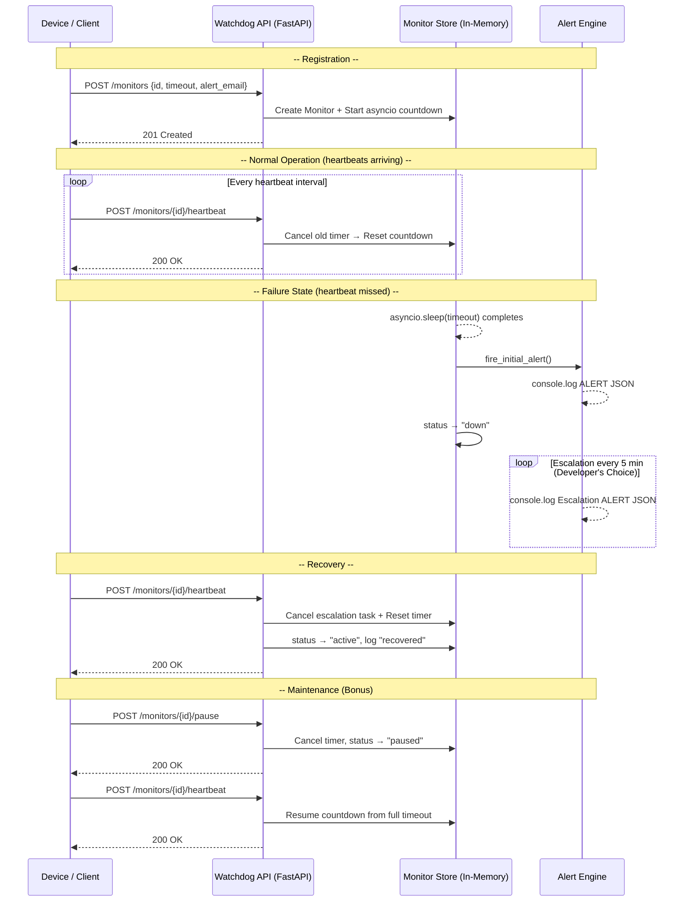

# Watchdog Sentinel - Pulse Check API

A **Dead Man's Switch API** for CritMon Servers Inc. Remote devices register a monitor with a countdown timer. If a device fails to send a heartbeat before the timer expires, the system fires an alert — and keeps firing until the device recovers.

---

## Architecture Diagram



### State Machine

```
         ┌─────────────────────────────────┐
         │                                 │
    POST /monitors                   POST /monitors/{id}/heartbeat
         │                                 │
         ▼                                 │
    ┌─────────┐   timeout expires   ┌──────┴──┐
    │ ACTIVE  │──────────────────▶  │  DOWN   │
    └─────────┘                     └─────────┘
         ▲                                 ▲
         │  heartbeat received             │  heartbeat received
         │                                 │
    ┌────┴────┐                            │
    │ PAUSED  │────────────────────────────┘
    └─────────┘
         ▲
         │  POST /monitors/{id}/pause
         │
      ACTIVE
```

---

## Setup Instructions

### Prerequisites
- Python 3.10+

### Install & Run

```bash
# 1. Clone the repository
git clone https://github.com/yiki-ui/AmaliTech-DEG-Project-based-challenges.git
cd AmaliTech-DEG-Project-based-challenges/backend/Pulse-Check

# 2. Create a virtual environment
python -m venv venv
source venv/bin/activate        # Windows: venv\Scripts\activate

# 3. Install dependencies
pip install -r requirements.txt

# 4. Start the server
uvicorn main:app --reload
```

The API will be live at `http://localhost:8000`.

Interactive docs (Swagger UI) are available at `http://localhost:8000/docs`.

---

## API Documentation

### Base URL
```
http://localhost:8000
```

---

### `POST /monitors` — Register a Monitor

Registers a new device monitor and starts the countdown timer.

**Request Body**
```json
{
  "id": "device-123",
  "timeout": 60,
  "alert_email": "admin@critmon.com"
}
```

**Response — `201 Created`**
```json
{
  "message": "Monitor 'device-123' registered. Countdown started for 60s.",
  "id": "device-123",
  "status": "active"
}
```

**Response — `409 Conflict`** (monitor ID already exists)
```json
{
  "detail": "Monitor 'device-123' already exists. Use heartbeat to reset."
}
```

---

### `POST /monitors/{id}/heartbeat` — Send Heartbeat

Resets the countdown timer. Also un-pauses a paused monitor.

**Example Request**
```bash
curl -X POST http://localhost:8000/monitors/device-123/heartbeat
```

**Response — `200 OK`**
```json
{
  "message": "Heartbeat received. Timer reset for 60s.",
  "id": "device-123",
  "status": "active"
}
```

**Response — `404 Not Found`**
```json
{
  "detail": "Monitor 'device-123' not found."
}
```

---

### `POST /monitors/{id}/pause` — Pause a Monitor

Stops the countdown completely. No alerts will fire while paused. Send a heartbeat to resume.

**Example Request**
```bash
curl -X POST http://localhost:8000/monitors/device-123/pause
```

**Response — `200 OK`**
```json
{
  "message": "Monitor 'device-123' paused. Send a heartbeat to resume.",
  "id": "device-123",
  "status": "paused"
}
```

---

### `GET /monitors/{id}` — Get Monitor Status

Returns the full status and audit trail of a single monitor.

**Example Request**
```bash
curl http://localhost:8000/monitors/device-123
```

**Response — `200 OK`**
```json
{
  "id": "device-123",
  "status": "active",
  "timeout": 60,
  "alert_email": "admin@critmon.com",
  "created_at": "2025-04-25T10:00:00.000000",
  "last_heartbeat": "2025-04-25T10:00:45.000000",
  "history": [
    { "event": "registered",  "timestamp": "2025-04-25T10:00:00.000000" },
    { "event": "heartbeat",   "timestamp": "2025-04-25T10:00:45.000000" }
  ]
}
```

---

### `GET /monitors` — List All Monitors

Returns a summary of all registered monitors.

**Example Request**
```bash
curl http://localhost:8000/monitors
```

**Response — `200 OK`**
```json
[
  {
    "id": "device-123",
    "status": "active",
    "timeout": 60,
    "alert_email": "admin@critmon.com",
    "created_at": "2025-04-25T10:00:00.000000",
    "last_heartbeat": "2025-04-25T10:00:45.000000"
  }
]
```

---

### `DELETE /monitors/{id}` — Delete a Monitor

Permanently removes a monitor and cancels all its timers.

**Example Request**
```bash
curl -X DELETE http://localhost:8000/monitors/device-123
```

**Response — `200 OK`**
```json
{
  "message": "Monitor 'device-123' has been removed.",
  "id": "device-123"
}
```

---

## Alert Output

When a monitor's timer expires, the following JSON object is printed to stdout (simulating an email alert):

```json
{
  "ALERT": "Device device-123 is down!",
  "alert_email": "admin@critmon.com",
  "time": "2026-04-25T10:01:00.000000"
}
```

---

## Developer's Choice — Alert Escalation & Audit Trail

### The Problem

The base spec fires a single alert when a device goes down. In a real infrastructure monitoring scenario, that alert can be missed — a support engineer might be away from their desk, or the notification could be buried. A device at a remote solar farm could remain offline for hours with no follow-up.

### What I Built

**Alert Escalation:** After the initial alert fires, a background escalation loop re-fires an alert every **5 minutes** until the device recovers (sends a heartbeat). Each escalation includes an incrementing count so engineers know how long the device has been down.

```json
{
  "ALERT": "[Escalation #3] Device device-123 is STILL down!",
  "alert_email": "admin@critmon.com",
  "time": "2026-04-25T10:16:00.000000"
}
```

**Audit Trail:** Every monitor maintains a timestamped event history — `registered`, `heartbeat`, `paused`, `alert_fired`, `escalation_alert_#N`, `recovered`. This is returned in `GET /monitors/{id}` and gives support engineers a complete post-incident timeline without needing to grep through server logs.

### Why It Matters

> "A single alert can be missed. Critical infrastructure monitoring needs persistent escalation and an immutable event log for post-incident analysis."

The escalation loop is implemented as a cancellable `asyncio` task — the moment the device sends a heartbeat, the loop is cancelled cleanly with no resource leaks.

---

## Project Structure

```
pulse-check-api/
├── main.py          # FastAPI app - routes and timer coroutine
├── models.py        # Pydantic request/response schemas
├── store.py         # Monitor class and in-memory store
├── alerts.py        # Alert firing and escalation loop
├── requirements.txt
└── README.md
```

---

## Tech Stack

| Layer | Technology |
|---|---|
| Framework | FastAPI |
| Async runtime | Python asyncio |
| Validation | Pydantic v2 |
| Server | Uvicorn |
| Storage | In-memory dict (no DB required) |
